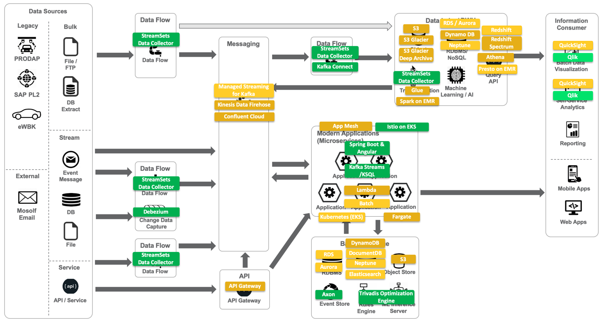

:TOC:

= Ueberschrift 1

== Ueberschrift 2

Text

=== Ueberschrift 3.1
=== Ueberschrift 3.2

==== Ueberschrift 4

===== Ueberschrift 5

normal, _italic_, *bold*, +mono typed+

Command: `ls -l`

.Labeled
Term 1::
    Definition 1 dfklsdjflksdjfklj dsfdsjlkfjdlkj fdafdlj fdsfdsf sflskfjslkdjfklj dflsdkjfjsdlkj fsklajflksdjfs dsdfdsfsdlks dlfjlksdjfklsdjfkljdsklfj
Term 2::
    Definition 2

This is a bullet list

* bullet
** bullet 2
*** bullet 3

This is a numbered list:

. One
. Two
. Three: lfjkslfjklfjlj flsdfj djflsdjk dfsakfldjsa  afdfs dfsdklfldf saddfds sdffsdfd ldfdfdd fdfdsafsdf dfsdsdff sfsdfdfds sdfdsffdfd fdsfsdsdfds

+

. *Three*: lfjkslfjklfjlj flsdfj djflsdjk dfsakfldjsa  afdfs dfsdklfldf saddfds sdffsdfd ldfdfdd fdfdsafsdf dfsdsdff sfsdfdfds sdfdsffdfd fdsfsdsdfds

Type some *text* which is rendered on the *right*.

TIP: there are

IMPORTANT: this is important

WARNING: be careful

CAUTION: do not use

[source,java]
----
public class Test {
  public void main() {
    system.out.println("test");
  }
}
----

(C)
(R)

http://google.com

---

.this block title
=====
Content in block
=====

.this block title
=====
Content in block
=====

test

This is some text about an object{wj}footnote:[This is the first footnote] is found.

Big Name footnote:[This is another footnote] is found.
