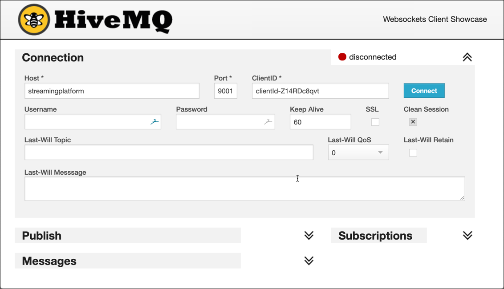

# IoT Truck Demo

This project shows how to setup and run the demo used in various talks, such as "Introduction into Stream Processing". 

## Prepare Environment

The environment is completley based on docker containers. In order to easily start the multiple containers, we are going to use Docker Compose. You need to have at least 8 GB of RAM available, better is 12 GB or 16 GB. 

### Preparing environment

First let's export the `SAMPLE_HOME` variable pointing to the local folder of this GitHub project, to simplify navigating below. 

```
export SAMPLE_HOME=/mnt/hgfs/git/gschmutz/various-demos/iot-truck-demo
```

For Kafka to work with this Docker Compose setup, two envrionment variables are necessary, which are configured with the IP address of the docker machine as well as the Public IP of the docker machine. 

You can either add them to `/etc/environment` (without export) to make them persistent:

```
export DOCKER_HOST_IP=192.168.25.136
export PUBLIC_IP=192.168.25.136
```

Make sure to adapt the IP address according to your environment. 

Optionally you can also create an `.env` file inside the `docker` folder with the following content:

```
DOCKER_HOST_IP=192.168.25.136
PUBLIC_IP=192.168.25.136
```

Last but not least add `streamingplatform` as an alias to the `/etc/hosts` file on the machine you are using to run the demo on.

```
192.168.25.136	streamingplatform
```

### Installing Kafkacat

To simplify peeking into a Kafka topic, the kafkacat tool becomes handy. You can optinally install it using the follwing command:

```
sudo apt-get install kafkacat
```

To see that it has been installed successfully, run a `kafkacat -V`

```
>kafkacat -V

kafkacat - Apache Kafka producer and consumer tool
https://github.com/edenhill/kafkacat
Copyright (c) 2014-2017, Magnus Edenhill
Version 1.4.0 (JSON) (librdkafka 1.0.0 builtin.features=gzip,snappy,ssl,sasl,regex,lz4,sasl_gssapi,sasl_plain,sasl_scram,plugins,zstd)
```

### Starting the infrastructure using Docker Compose

Create 

Now we can start the environment. Navigate to the `docker` sub-folder inside the `SAMPLE_HOME` folder. 

```
cd $SAMPLE_HOME/docker
mkdir kafka-connect
```

and start the vaious docker containers 

```
docker-compose up -d
```

To show all logs of all containers use

```
docker-compose logs -f
```

To show only the logs for some of the containers, for example `connect-1` and `connect-2`, use

```
docker-compose logs -f connect-1 connect-2
```

Some services in the `docker-compose.yml` are optional and can be removed, if you don't have enough resources to start them. 

### Available Services 

The following user interfaces are available:

 * Confluent Control Center: <http://streamingplatform:9021>
 * Kafka Manager: <http://streamingplatform:9000> 
 * KAdmin: <http://streamingplatform:28080>
 * KafkaHQ: <http://streamingplatform:28082>
 * Kafdrop: <http://streamingplatform:29020>
 * Schema Registry UI: <http://streamingplatform:8002>
 * Kafka Connect UI: <http://streamingplatform:8003>
 * StreamSets Data Collector: <http://streamingplatform:18630>
 * Tsujun KSQL UI: <http://streamingplatform:28083>
 * MQTT UI: <http://streamingplatform:29080>

### Creating the necessary Kafka Topics

The Kafka cluster is configured with `auto.topic.create.enable` set to `false`. Therefore we first have to create all the necessary topics, using the `kafka-topics` command line utility of Apache Kafka. 

We can easily get access to the `kafka-topics` CLI by navigating into one of the containers for the 3 Kafka Borkers. Let's use `broker-1`

```
docker exec -ti broker-1 bash
```

First lets see all existing topics

```
kafka-topics --zookeeper zookeeper-1:2181 --list
```

And now create the topics `truck_position`, `dangerous_driving_and_driver ` and `truck_driver`.

```
kafka-topics --zookeeper zookeeper-1:2181 --create --topic truck_position --partitions 8 --replication-factor 2
kafka-topics --zookeeper zookeeper-1:2181 --create --topic dangerous_driving --partitions 8 --replication-factor 2
kafka-topics --zookeeper zookeeper-1:2181 --create --topic dangerous_driving_and_driver --partitions 8 --replication-factor 2

kafka-topics --zookeeper zookeeper-1:2181 --create --topic truck_driver --partitions 8 --replication-factor 2 --config cleanup.policy=compact --config segment.ms=100 --config delete.retention.ms=100 --config min.cleanable.dirty.ratio=0.001
```

If you don't like to work with the CLI, you can also create the Kafka topics using the [Kafka Manager GUI](http://streamingplatform:9000). 

### Prepare Database Table

We also need a database table holding the information of the truck driver. 

The infrastructure we have started above also conains an instance of Postgresql in a separate docker container. 

Let's connect to that container 

```
docker exec -ti postgresql bash
```

and run the `psql` command line utility. 

```
psql -d sample -U sample
```

```
DROP TABLE driver;
CREATE TABLE driver (id BIGINT, first_name CHARACTER VARYING(45), last_name CHARACTER VARYING(45), available CHARACTER VARYING(1), birthdate DATE, last_update TIMESTAMP);
ALTER TABLE driver ADD CONSTRAINT driver_pk PRIMARY KEY (id);
```

```
INSERT INTO "driver" ("id", "first_name", "last_name", "available", "birthdate", "last_update") VALUES (10,'Diann', 'Butler', 'Y', '10-JUN-68', CURRENT_TIMESTAMP);
INSERT INTO "driver" ("id", "first_name", "last_name", "available", "birthdate", "last_update") VALUES (11,'Micky', 'Isaacson', 'Y', '31-AUG-72' ,CURRENT_TIMESTAMP);
INSERT INTO "driver" ("id", "first_name", "last_name", "available", "birthdate", "last_update") VALUES (12,'Laurence', 'Lindsey', 'Y', '19-MAY-78' ,CURRENT_TIMESTAMP);
INSERT INTO "driver" ("id", "first_name", "last_name", "available", "birthdate", "last_update") VALUES (13,'Pam', 'Harrington', 'Y','10-JUN-68' ,CURRENT_TIMESTAMP);
INSERT INTO "driver" ("id", "first_name", "last_name", "available", "birthdate", "last_update") VALUES (14,'Brooke', 'Ferguson', 'Y','10-DEC-66' ,CURRENT_TIMESTAMP);
INSERT INTO "driver" ("id", "first_name", "last_name", "available", "birthdate", "last_update") VALUES (15,'Clint','Hudson', 'Y','5-JUN-75' ,CURRENT_TIMESTAMP);
INSERT INTO "driver" ("id", "first_name", "last_name", "available", "birthdate", "last_update") VALUES (16,'Ben','Simpson', 'Y','11-SEP-74' ,CURRENT_TIMESTAMP);
INSERT INTO "driver" ("id", "first_name", "last_name", "available", "birthdate", "last_update") VALUES (17,'Frank','Bishop', 'Y','3-OCT-60' ,CURRENT_TIMESTAMP);
INSERT INTO "driver" ("id", "first_name", "last_name", "available", "birthdate", "last_update") VALUES (18,'Trevor','Hines', 'Y','23-FEB-78' ,CURRENT_TIMESTAMP);
INSERT INTO "driver" ("id", "first_name", "last_name", "available", "birthdate", "last_update") VALUES (19,'Christy','Stephens', 'Y','11-JAN-73' ,CURRENT_TIMESTAMP);
INSERT INTO "driver" ("id", "first_name", "last_name", "available", "birthdate", "last_update") VALUES (20,'Clarence','Lamb', 'Y','15-NOV-77' ,CURRENT_TIMESTAMP);

INSERT INTO "driver" ("id", "first_name", "last_name", "available", "birthdate", "last_update") VALUES (21,'Lila', 'Page', 'Y', '5-APR-77', CURRENT_TIMESTAMP);
INSERT INTO "driver" ("id", "first_name", "last_name", "available", "birthdate", "last_update") VALUES (22,'Patricia', 'Coleman', 'Y', '11-AUG-80' ,CURRENT_TIMESTAMP);
INSERT INTO "driver" ("id", "first_name", "last_name", "available", "birthdate", "last_update") VALUES (23,'Jeremy', 'Olson', 'Y', '13-JUN-82', CURRENT_TIMESTAMP);
INSERT INTO "driver" ("id", "first_name", "last_name", "available", "birthdate", "last_update") VALUES (24,'Walter', 'Ward', 'Y', '24-JUL-85', CURRENT_TIMESTAMP);
INSERT INTO "driver" ("id", "first_name", "last_name", "available", "birthdate", "last_update") VALUES (25,'Kristen', ' Patterson', 'Y', '14-JUN-73', CURRENT_TIMESTAMP);
INSERT INTO "driver" ("id", "first_name", "last_name", "available", "birthdate", "last_update") VALUES (26,'Jacquelyn', 'Fletcher', 'Y', '24-AUG-85', CURRENT_TIMESTAMP);
INSERT INTO "driver" ("id", "first_name", "last_name", "available", "birthdate", "last_update") VALUES (27,'Walter', '  Leonard', 'Y', '12-SEP-88', CURRENT_TIMESTAMP);
INSERT INTO "driver" ("id", "first_name", "last_name", "available", "birthdate", "last_update") VALUES (28,'Della', ' Mcdonald', 'Y', '24-JUL-79', CURRENT_TIMESTAMP);
INSERT INTO "driver" ("id", "first_name", "last_name", "available", "birthdate", "last_update") VALUES (29,'Leah', 'Sutton', 'Y', '12-JUL-75', CURRENT_TIMESTAMP);
INSERT INTO "driver" ("id", "first_name", "last_name", "available", "birthdate", "last_update") VALUES (30,'Larry', 'Jensen', 'Y', '14-AUG-83', CURRENT_TIMESTAMP);
INSERT INTO "driver" ("id", "first_name", "last_name", "available", "birthdate", "last_update") VALUES (31,'Rosemarie', 'Ruiz', 'Y', '22-SEP-80', CURRENT_TIMESTAMP);
INSERT INTO "driver" ("id", "first_name", "last_name", "available", "birthdate", "last_update") VALUES (32,'Shaun', ' Marshall', 'Y', '22-JAN-85', CURRENT_TIMESTAMP);
```
## Runnging the Truck Simulator (1)

For simulating truck data, we are going to use a Java program (adapted from Hortonworks) and maintained in this [GitHub project](https://github.com/TrivadisBDS/various-bigdata-prototypes/tree/master/streaming-sources/iot-truck-simulator/impl).

The simulator can produce data either to a **Kafka** or **MQTT**. These two options are shown below. 

### Producing to Kafka

First let's start a consumer on the topic `truck_position` either using the `kafka-console-consumer `or `kafkacat` CLI. 

* To start consuming using the kafka console consumer:
 
	```
docker exec -ti broker-1 kafka-console-consumer --bootstrap-server broker-1:9092 --topic truck_position
```

* To start consuming using kafkacat (using the quiet option):

	```
kafkacat -b analyticsplatform:9092 -t truck_position -q
```

Now let's produce the truck events to the Kafka topic `truck_position `.

```
docker run trivadis/iot-truck-simulator '-s' 'KAFKA' '-h' $DOCKER_HOST_IP '-p' '9092' '-f' 'CSV' "-t" "sec"
```

### Producing to MQTT

First let's start a consumer on the MQTT topics `trucks/+/position`. 

 * To start consuming using through a command line, perform the following docker command:

	```
docker run -it --rm efrecon/mqtt-client sub -h $DOCKER_HOST_IP -t "truck/+/position" -v
```
  
 * to start consuming using the MQTT UI (HiveMQ Web Client), navigate to <http://streamingplatform:29080> and connect using `streamingplatform` for the **Host** field, `9001` for the **Port** field and then click on **Connect**: 

	
	
	When successfully connected, click on Add New Topic Subscription and enter `truck/+/position` into **Topic** field and click **Subscribe**:
	
	
	

Now let's produce the truck events to the MQTT broker running on port 1883:

```
docker run trivadis/iot-truck-simulator '-s' 'MQTT' '-h' $DOCKER_HOST_IP '-p' '1883' '-f' 'CSV'
```

As soon as messages are produced to MQTT, you should see them either on the CLI or in the MQTT UI (Hive MQ) as shown below.


Alternatively you can also use the [MQTT.fx](https://mqttfx.jensd.de/) or the [MQTT Explorer](https://mqtt-explorer.com/) applications to browse for the messages on the MQTT broker. They are both available for installation on Mac or Windows. 

## Using Kafka Connect to bridge between MQTT and Kafka (2)

In order to get the messages from MQTT into Kafka, we will be using Kafka Connect. Luckily, there are multiple Kafka Connectors available for MQTT. We will be using the one available from the [Landoop Stream-Reactor Project](https://github.com/Landoop/stream-reactor/tree/master/kafka-connect-mqtt) called `kafka-connect-mqtt`.

As part of the restart of the `connect` service, the `kafka-connect` folder mapped into the container should have been created on the Docker host. Make sure that it belongs to the `cas` user by executing the following command:

```
sudo chown bigdata:bigdata -R kafka-connect
```

Then navigate into the `kafka-connect` folder, create a folder `mqtt` and navigate into this folder.

```
mkdir mqtt
cd mqtt
```

In here, download the `kafka-connect-mqtt-1.1.1-2.1.0-all.tar.gz` file from the [Landoop Stream-Reactor Project](https://github.com/Landoop/stream-reactor/tree/master/kafka-connect-mqtt).

```
wget https://github.com/Landoop/stream-reactor/releases/download/1.2.1/kafka-connect-mqtt-1.2.1-2.1.0-all.tar.gz
```

Once it is successfully downloaded, untar it using this `tar` command. 

```
tar xvf kafka-connect-mqtt-1.0.0-1.0.0-all.tar.gz
```

Now let's restart Kafka connect in order to pick up the new connector. 

```
docker-compose restart connect-1 connect-2
```


First let's listen on the topic 

```
kafkacat -b streamingplatform:9092 -t truck_position -q
```

Add and start the MQTT connector (make sure that consumer is still running):

```
cd $SAMPLE_HOME/scripts
./start-connect-mqtt.sh
```

Navigate to the [Kafka Connect UI](http://streamingplatform:8003) to see the connector configured and running.

You can remove the connector using the following command

```
curl -X "DELETE" "$DOCKER_HOST_IP:8083/connectors/mqtt-source"
```

## MQTT to Kafa using Confluent MQTT Proxy (3)

Make sure that the MQTT proxy has been started as a service in the `docker-compose.yml`.

```
  mqtt-proxy:
    image: confluentinc/cp-kafka-mqtt:5.2.1
    hostname: mqtt-proxy
    ports:
      - "1884:1884"
    environment:
      KAFKA_MQTT_TOPIC_REGEX_LIST: 'truck_position:.*position,truck_engine:.*engine'
      KAFKA_MQTT_LISTENERS: 0.0.0.0:1884
      KAFKA_MQTT_BOOTSTRAP_SERVERS: PLAINTEXT://broker-1:9092,broker-2:9093
      KAFKA_MQTT_CONFLUENT_TOPIC_REPLICATIN_FACTOR: 1
```

Change the truck simulator to produce on port 1884, which is the one the MQTT proxy listens on.

```
mvn exec:java -Dexec.args="-s MQTT -f CSV -p 1884 -m SPLIT -t millisec"
```

## Using KSQL for Stream Analytics (4)

### Connect to KSQL CLI


First let's connect to the KSQL CLI

```
docker run -it --network analyticsplatform_default confluentinc/cp-ksql-cli http://ksql-server-1:8088
```

Show the available Kafka topics

```
show topics;
```


```
print 'truck_position';
```

```
print 'truck_position' from beginning;
```

```
show streams;
show tables;
show queries;
```

### Basic Streaming Query

Create a KSQL STREAM object on the `truck_position`

```
DROP STREAM IF EXISTS truck_position_s;

CREATE STREAM truck_position_s \
  (ts VARCHAR, \
   truckId VARCHAR, \
   driverId BIGINT, \
   routeId BIGINT, \
   eventType VARCHAR, \
   latitude DOUBLE, \
   longitude DOUBLE, \
   correlationId VARCHAR) \
  WITH (kafka_topic='truck_position', \
        value_format='DELIMITED');
```

Get info on the stream using the `DESCRIBE` command

```
DESCRIBE truck_position_s;
DESCRIBE EXTENDED truck_position_s;
```

```
SELECT * FROM truck_position_s;
```

```
cd $SAMPLE_HOME/scripts/
./stop-connect-mqtt.sh
```


```
ksql> SELECT * from truck_position_s;

1539711991642 | truck/24/position | null | 24 | 10 | 1198242881 | Normal | 36.84 | -94.83 | -6187001306629414077
1539711991691 | truck/26/position | null | 26 | 13 | 1390372503 | Normal | 42.04 | -88.02 | -6187001306629414077
1539711991882 | truck/66/position | null | 66 | 22 | 1565885487 | Normal | 38.33 | -94.35 | -6187001306629414077
1539711991902 | truck/22/position | null | 22 | 26 | 1198242881 | Normal | 36.73 | -95.01 | -6187001306629414077
1539711992051 | truck/97/position | null | 97 | 30 | 1325712174 | Normal | 41.89 | -87.66 | -6187001306629414077
```

### Streaming Filter with KSQL

Now let's filter on all the info messages, where the `eventType` is not normal:

```
SELECT * FROM truck_position_s WHERE eventType != 'Normal';
```

```
1539712101614 | truck/67/position | null | 67 | 11 | 160405074 | Lane Departure | 38.98 | -92.53 | -6187001306629414077
1539712116450 | truck/18/position | null | 18 | 25 | 987179512 | Overspeed | 40.76 | -88.77 | -6187001306629414077
1539712118653 | truck/67/position | null | 67 | 11 | 160405074 | Overspeed | 38.83 | -90.79 | -6187001306629414077
1539712120102 | truck/31/position | null | 31 | 12 | 927636994 | Unsafe following distance | 38.22 | -91.18 | -6187001306629414077
```

## Create a new Stream based on the KSQL SELECT (5)

Let's provide the data as a topic:

First create a topic where all "dangerous driving" events should be sent to
	
```
docker exec broker-1 kafka-topics --zookeeper zookeeper-1:2181 --create --topic dangerous_driving --partitions 8 --replication-factor 2
```

Now create a "console" listener on the topic, either using the `kafka-console-consumer`

```
kafka-console-consumer --bootstrap-server broker-1:9092 --topic dangerous_driving
```

or the `kafkacat` utility.

```
kafkacat -b analyticsplatform -t dangerous_driving
```

```
docker run -it --network analyticsplatform_default confluentinc/cp-ksql-cli http://ksql-server-1:8088
```

```
DROP STREAM dangerous_driving_s;
```

```
CREATE STREAM dangerous_driving_s \
  WITH (kafka_topic='dangerous_driving', \
        value_format='JSON', \
        partitions=8) \
AS SELECT * FROM truck_position_s \
WHERE eventType != 'Normal';
```

```
SELECT * FROM dangerous_driving_s;
```

## Aggregations using KSQL (6)

DROP TABLE dangerous_driving_count;

```
CREATE TABLE dangerous_driving_count \
AS SELECT eventType, count(*) nof \
FROM dangerous_driving_s \
WINDOW TUMBLING (SIZE 30 SECONDS) \
GROUP BY eventType;
```

```
SELECT  TIMESTAMPTOSTRING(ROWTIME, 'yyyy-MM-dd HH:mm:ss.SSS'), eventType, nof \
FROM dangerous_driving_count;
```

```
CREATE TABLE dangerous_driving_count
AS
SELECT eventType, count(*) nof \
FROM dangerous_driving_s \
WINDOW HOPPING (SIZE 30 SECONDS, ADVANCE BY 10 SECONDS) \
GROUP BY eventType;
```

## Join with Static Driver Data (7)

### Start the synchronization from the RDBMS table "truck"
First start the console consumer on the `truck_driver` topic:

```
docker exec -ti broker-1 kafka-console-consumer --bootstrap-server broker-1:9092 --topic truck_driver --from-beginning
```

Print the key and value of the truck_driver topic

```
kafkacat -b analyticsplatform -t truck_driver -f "%k::%s\n" -u -q
```

then start the JDBC connector:

```
cd $SAMPLE_HOME
./scripts/start-connect-jdbc.sh
```

To stop the connector execute the following command

```
curl -X "DELETE" "http://$DOCKER_HOST_IP:8083/connectors/jdbc-driver-source"
```

Perform an update to see that these will be delivered

```
docker exec -ti docker_db_1 bash

psql -d sample -U sample
```

```
UPDATE "driver" SET "available" = 'N', "last_update" = CURRENT_TIMESTAMP  WHERE "id" = 21;
```

```
UPDATE "driver" SET "available" = 'N', "last_update" = CURRENT_TIMESTAMP  WHERE "id" = 14;
```

Stop the consumer and restart with `--from-beginning` option

```
docker exec -ti broker-1 kafka-console-consumer --bootstrap-server broker-1:9092 --topic truck_driver --from-beginning
```

### Create a KSQL table

In the KSQL CLI, let's create a table over the `truck_driver` topic. It will hold the latest state of all the drivers:

```
set 'commit.interval.ms'='5000';
set 'cache.max.bytes.buffering'='10000000';
set 'auto.offset.reset'='earliest';

DROP TABLE driver_t;

CREATE TABLE driver_t  \
   (id BIGINT,  \
   first_name VARCHAR, \
   last_name VARCHAR, \
   available VARCHAR, \
   birthdate VARCHAR) \
  WITH (kafka_topic='truck_driver', \
        value_format='JSON', \
        KEY = 'id');
```

Let's see that we actually have some drivers in the table. 

```
set 'commit.interval.ms'='5000';
set 'cache.max.bytes.buffering'='10000000';
set 'auto.offset.reset'='earliest';

SELECT * FROM driver_t;
```


```
docker exec -ti postgresql psql -d sample -U sample
```

```
UPDATE "driver" SET "available" = 'N', "last_update" = CURRENT_TIMESTAMP  WHERE "id" = 21;
```


join `dangerous_driving_s` stream to `driver_t` table

```
set 'commit.interval.ms'='5000';
set 'cache.max.bytes.buffering'='10000000';
set 'auto.offset.reset'='latest';
```

```
SELECT driverid, first_name, last_name, truckId, routeId, eventType, latitude, longitude \
FROM dangerous_driving_s \
LEFT JOIN driver_t \
ON dangerous_driving_s.driverId = driver_t.id;
```

with outer join

```
SELECT driverid, first_name, last_name, truckId, routeId, eventType, latitude, longitude \
FROM dangerous_driving_s \
LEFT OUTER JOIN driver_t \
ON dangerous_driving_s.driverId = driver_t.id;
```

Create Stream `dangerous_driving_and_driver`

```
DROP STREAM dangerous_driving_and_driver_s;
CREATE STREAM dangerous_driving_and_driver_s  \
  WITH (kafka_topic='dangerous_driving_and_driver', \
        value_format='JSON', partitions=8) \
AS SELECT driverid, first_name, last_name, truckId, routeId, eventType, latitude, longitude \
FROM dangerous_driving_s \
LEFT JOIN driver_t \
ON dangerous_driving_s.driverId = driver_t.id;
```


```
SELECT * FROM dangerous_driving_and_driver_s;
```

```
SELECT * FROM dangerous_driving_and_driver_s WHERE driverid = 11;
```

Perform an update on the first_name to see the change in the live stream:

```
docker exec -ti docker_db_1 bash

psql -d sample -U sample
```

```
UPDATE "driver" SET "first_name" = 'Slow Down Mickey', "last_update" = CURRENT_TIMESTAMP  WHERE "id" = 11;
UPDATE "driver" SET "first_name" = 'Slow Down Patricia', "last_update" = CURRENT_TIMESTAMP  WHERE "id" = 22;
```

## GeoHash and Aggregation (8)

```
SELECT latitude, longitude, geohash(latitude, longitude, 4) \
FROM dangerous_driving_s;
```

```
ksql> SELECT latitude, longitude, geohash(latitude, longitude, 4) \
      FROM dangerous_driving_s;
38.31 | -91.07 | 9yz1
37.7 | -92.61 | 9ywn
34.78 | -92.31 | 9ynm
42.23 | -91.78 | 9zw8
```

```
DROP STREAM dangerous_driving_and_driver_geohashed_s;
CREATE STREAM dangerous_driving_and_driver_geohashed_s \
  WITH (kafka_topic='dangerous_and_position', \
        value_format='JSON', partitions=8) \
AS SELECT driverid, first_name, last_name, truckid, routeid, eventtype, geohash(latitude, longitude, 4) as geohash \
FROM dangerous_driving_and_driver_s;
```

```
SELECT eventType, geohash, count(*) nof \
FROM dangerous_driving_and_driver_geohashed_s \
WINDOW TUMBLING (SIZE 120 SECONDS) \
GROUP BY eventType, geohash;
```


## Current Positions

CREATE TABLE truck_position_t \
  WITH (kafka_topic='truck_position_t', \
        value_format='JSON', \
        KEY = 'truckid') \
AS SELECT truck_id,  FROM truck_position_s GROUP BY truckid; 


## More complex analytics in KSQL

```
CREATE TABLE dangerous_driving_count \
AS SELECT eventType, count(*) \
FROM dangerous_driving_and_driver_s \
WINDOW TUMBLING (SIZE 30 SECONDS) \
GROUP BY eventType;
```

```
CREATE TABLE dangerous_driving_count
AS
SELECT eventType, count(*) \
FROM dangerous_driving_and_driver_s \
WINDOW HOPPING (SIZE 30 SECONDS, ADVANCE BY 10 SECONDS) \
GROUP BY eventType;
```

```
SELECT first_name, last_name, eventType, count(*) \
FROM dangerous_driving_and_driver_s \
WINDOW TUMBLING (SIZE 20 SECONDS) \
GROUP BY first_name, last_name, eventType;
```


## Using Kafka Streams to detect danagerous driving

```
docker exec -ti broker-1 bash
```

```
kafka-topics --zookeeper zookeeper-1:2181 --create --topic dangerous_driving --partitions 8 --replication-factor 2
kafka-console-consumer --bootstrap-server broker-1:9092 --topic dangerous_driving
```

```
cd $SAMPLE_HOME/src/kafka-streams-truck
mvn exec:java
```
